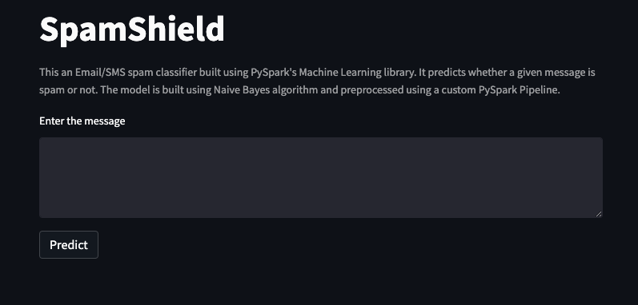

# SpamShield - with PySpark's Machine Learning library and deployed on Streamlit

SpamShield is an Email/SMS spam classifier built using PySpark's Machine Learning library. It predicts whether a given message is spam or not. The model is built using Naive Bayes algorithm and preprocessed using a custom PySpark Pipeline.

## Demo
A demo of this application is available on Streamlit - [SpamShield](https://ajosegun-spamshield.streamlit.app/)




## Features
1. Prediction: The application can predict whether a given message is spam or not.

2. Custom PySpark Pipeline: The message is preprocessed using a custom PySpark Pipeline to ensure that it is correctly formatted and cleaned before it is fed into the model for prediction.

3. Naive Bayes Algorithm: The model is built using Naive Bayes algorithm, which is a simple yet effective algorithm for text classification.

4. User Interface: The application has a simple and user-friendly interface that allows users to enter a message and get a prediction with just a click of a button.

5. Easy to Use: The application can be easily installed and used on any machine that has Python and the required packages installed.

6. Efficient: The PySpark library allows the application to handle large amounts of data efficiently, making it suitable for businesses and individuals who receive a high volume of messages.

## Requirements
Python 3.6 or higher
findspark
pyspark
streamlit
numpy

## Installation
To install the required packages, run the following command:
pip install -r requirements.txt

## Usage
To run the application, navigate to the root directory of the project in the terminal and run the following command:

```
streamlit run app.py
```

This will start the application and launch a local server at http://localhost:8501/ in your web browser.

## Model
The model is built using Naive Bayes algorithm and preprocessed using a custom PySpark Pipeline. The trained model and the pipeline are saved as separate files and loaded into the application at runtime.

## Conclusion
The custom PySpark Pipeline ensures that the message is preprocessed correctly before it is fed into the model for prediction. This application can be useful for individuals and businesses to filter out spam messages from their inbox and focus on important messages.


